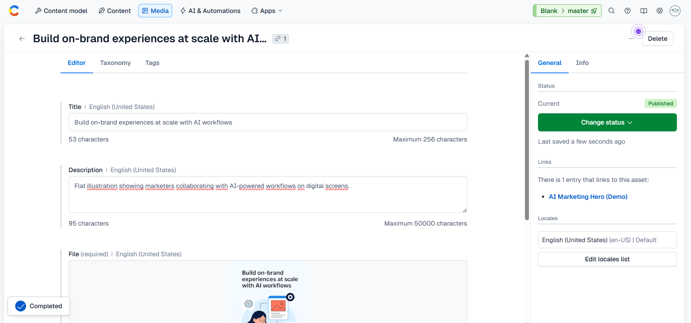
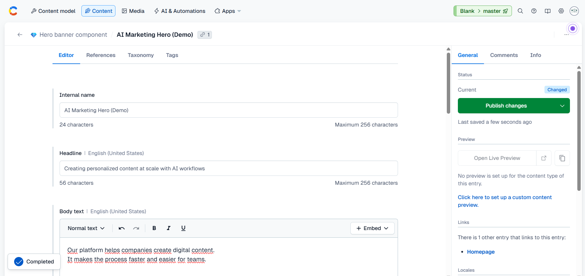
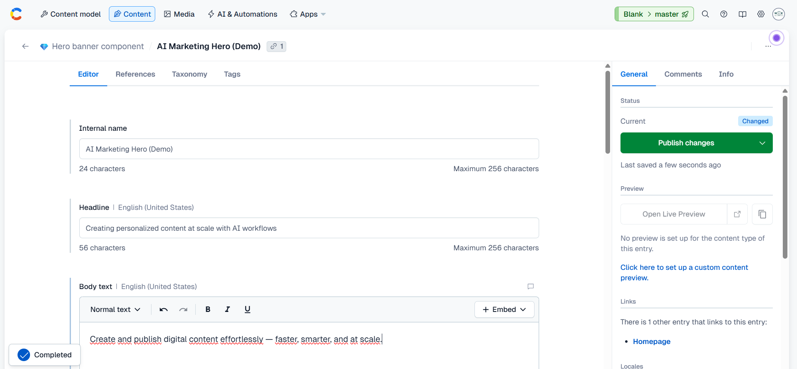
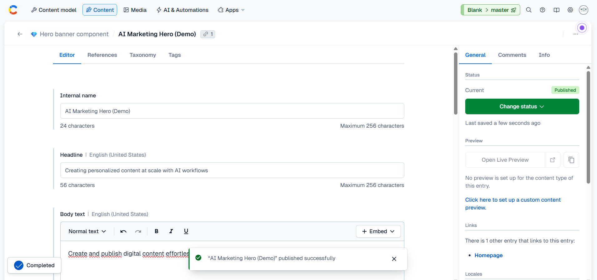
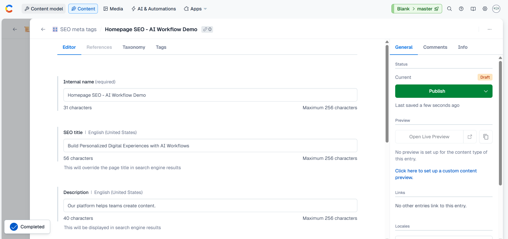
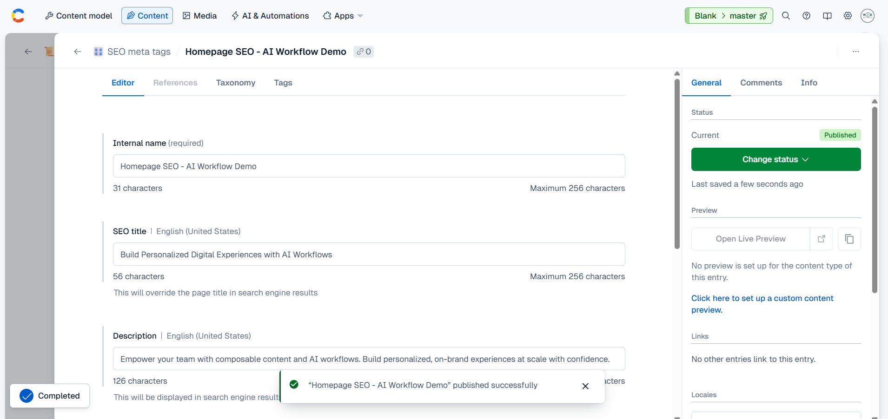

# contentful-ai-demo

Portfolio demo simulating AI workflows in Contentful (**Alt Text, Rewrite/Tone Adjustment, SEO Optimization**).

---

## 📑 Table of Contents
- 📸 [A. Alt Text Workflow](#a-alt-text-workflow)
- ✍️ [B. Rewrite / Tone Adjustment](#b-rewrite--tone-adjustment-workflow)
- 🔍 [C. SEO Optimization](#c-seo-optimization-workflow)
- ✅ [Conclusion](#conclusion)
- ⭐ [Why this project matters](#why-this-project-matters)

---

## A. Alt Text Workflow

**Capture A1 (Before alt text)**  
  

**README:**  
Explored Contentful AI Actions (alt text generation, rewrite, SEO optimization). These features are only available on premium plans, but I designed workflows and prompts that demonstrate how they would be applied in real scenarios.  

---

**Capture A2 (After alt text)**  
  

**README:**  
Simulated AI alt text workflow: generated descriptive alt text with external AI and applied it into Contentful for accessibility & SEO.  

---

**Capture A3 (After Published)**  
  

**README:**  
Published the simulated AI alt text into Contentful entry to complete the workflow.  

**Impact:**  
- Improved accessibility & SEO.  
- Demonstrated ability to integrate AI support into CMS workflows.  

---

## B. Rewrite / Tone Adjustment Workflow

**Capture B1 (Text before Rewrite)**  
  

**README:**  
Field Body Text with original context.  

---

**Capture B2 (Text after Rewrite)**  
  

**README:**  
**Prompt (AI Simulation):**  
“Rewrite this copy in a concise, on-brand, marketing tone.”  

Original:  
> Our platform helps companies create digital content.  
> It makes the process faster and easier for teams.  

After (AI-style rewrite):  
> Create and publish digital content effortlessly — faster, smarter, and at scale.  

---

**Capture B3 (Text after rewrite + status Published)**  
  

**README:**  
Published the rewritten copy into Contentful entry.  

---

**Capture B4 (Preview text after rewrite)**  
  

**README:**  
Verified changes in Contentful Live Preview to confirm rewritten on-brand copy was instantly reflected on the marketing website template.  

**Impact:**  
- Faster iteration cycles.  
- On-brand, concise, and engaging tone at scale.  

---

## C. SEO Optimization Workflow

**Capture C1 (Before SEO optimization)**  
  

**README:**  
Homepage was missing SEO metadata, meaning search engines would only use default page titles.  

---

**Capture C2 (After SEO optimization - Published)**  
  

**README:**  
Configured SEO meta tags by linking a custom entry (*Homepage SEO – AI Workflow Demo*).  

---

**Capture C3 (After with SEO metadata)**  
  

**README:**  
Added optimized SEO title + description to improve discoverability and keyword relevance.  

**Impact:**  
- Improved search engine ranking and alignment with keywords.  
- Ensured Homepage is SEO-ready and channel optimized.  

---

## Conclusion
By simulating **Alt Text**, **Rewrite/Tone Adjustment**, and **SEO Optimization** workflows:  
- Showed how AI improves **accessibility, engagement, and discoverability**.  
- Demonstrated **hands-on product thinking**: problem → solution → measurable impact.  
- Highlighted readiness for **AI Product Manager** roles bridging business needs and technical execution.  

---

## Why this project matters
This project goes beyond a technical demo.  
It shows how **structured data, automation, and scalable processes** can be applied in real-world workflows — aligning directly with Contentful’s mission to deliver **impactful on-brand experiences in an automated and scalable way**.  

As a candidate, I bring a **unique perspective**:  
- Past experience as Project Manager (process mindset).  
- Hands-on tech background (Backend & QA).  
- Now applying these skills in **AI product workflows**.  

---
