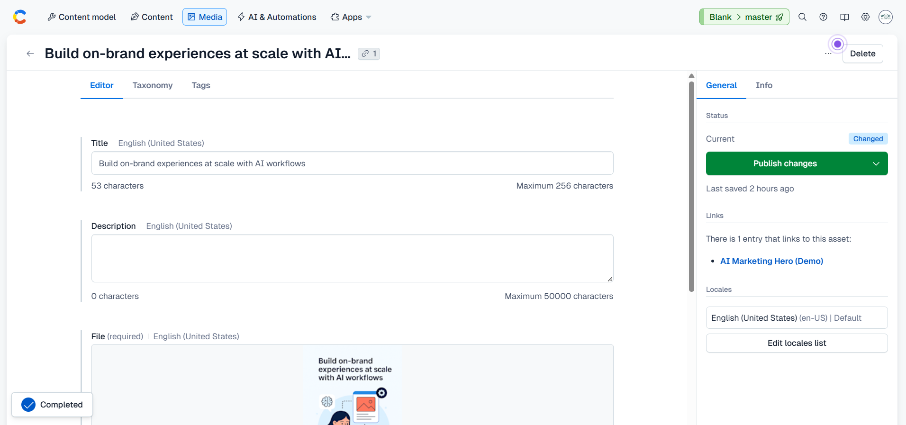
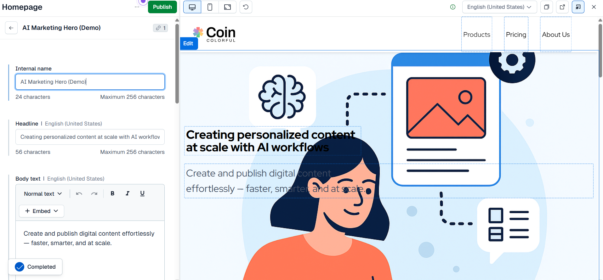
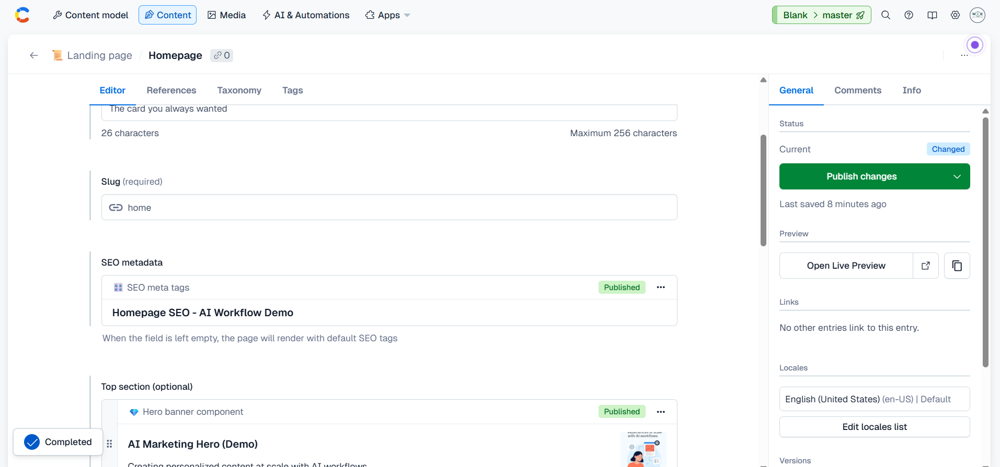

# contentful-ai-demo

Portfolio demo simulating AI workflows in Contentful (**Alt Text, Rewrite/Tone Adjustment, SEO Optimization**).

---

## 📑 Table of Contents
- [A. Alt Text Workflow](#a-alt-text-workflow)
- [B. Rewrite / Tone Adjustment](#b-rewrite--tone-adjustment)
- [C. SEO Optimization](#c-seo-optimization)
- [Conclusion](#conclusion)
- [Screenshots](#screenshots)
- [Why this project matters](#why-this-project-matters)

---

## A. Alt Text Workflow
- Simulated AI alt text generation for accessibility & SEO.
- Added descriptive metadata for images.
- Verified publish flow inside Contentful.

---

## B. Rewrite / Tone Adjustment
- Applied rewrite/tone adjustments to marketing copy.
- Demonstrated how AI can optimize user-facing content.
- Showed preview in Contentful before publishing.

---

## C. SEO Optimization
- Created custom SEO meta entry.
- Optimized **title** and **description** for better discoverability.
- Linked SEO metadata into Homepage.

---

## ✅ Conclusion
By simulating **Alt Text**, **Rewrite/Tone Adjustment**, and **SEO Optimization** workflows:
- Showed how AI improves **accessibility, engagement, and discoverability**.  
- Demonstrated **hands-on product thinking** (problem → solution → outcome).  
- Highlights readiness for **AI Product Manager** roles bridging content, AI, and UX.  

---

## ⭐ Why this project matters
This project goes beyond a technical demo.  
It shows how **structured data, automation, and scalable processes** can be applied in real-world workflows — aligning directly with Contentful’s mission to deliver **impactful on-brand experiences in an automated and scalable way**.  

As a candidate, I bring a **unique perspective**:  
- Past experience as Project Manager (process mindset).  
- Hands-on tech background (backend & QA).  
- Now applying these skills in **AI product workflows**.  

---
